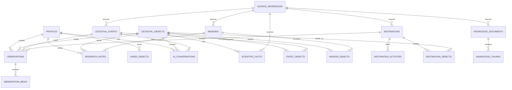

# PRD — COSMORA

**Status:** MVP Definition  
**Product:** COSMORA  
**Core concept:** One exploration experience, multiple user intents.  
**Primary loop:** Explore → Understand → Act → Document → Explore Again

---

## 1. Product Definition

COSMORA is an immersive web platform that helps people explore space and astronomy, understand what they discover, and turn that discovery into an action such as observing, photographing, researching, visiting an astronomy destination, or documenting the experience.

The MVP is **not** a dashboard, generic astronomy chatbot, photography-only planner, scientific database, or tourism marketplace.

The product is an **AI-powered exploration layer** over real astronomical data.

### Core promise

> Explore the universe. Understand what you find. Experience it in the real world.

---

## 2. Problem Statement

Astronomy information is rich but spread across different tools, datasets, visualizations, and levels of technical complexity. A user may find an object but still need separate workflows to understand it, determine whether it can be observed, plan a photography session, research it, or discover a relevant real-world astronomy experience.

**Problem:** users need a friendlier way to move from curiosity to understanding to action without being locked into a single persona or specialist workflow.

### Key product gap

Existing products often specialize in one area: sky simulation, observation planning, astrophotography, scientific archives, or astronomy destinations. The MVP focuses on the connective layer:

**user intent + real data + context + AI → actionable astronomy insight**

This is a product hypothesis that must be validated with user research; do not present it as an already-proven universal pain point.

---

## 3. Target Users

### Primary audience: Astronomy & Space Enthusiasts

Three user patterns share the same core experience:

1. **General space enthusiast** — curiosity, learning, discovery.
2. **Astronomy enthusiast / astrophotographer** — observation and documentation.
3. **Student / researcher** — study, investigation, scientific context.

Do not build separate “modes” for these users. Persona is not permission. The same user can switch intent at any time.

### Shared intent examples

- “Show me something interesting.”
- “Explain Mars.”
- “What can I observe tonight?”
- “What can I photograph?”
- “I want to research this object.”
- “Where can I experience this in person?”

---

## 4. Product Principles

1. **Object/event is the center, not the persona.**
2. **Hybrid entry:** visual exploration and intent/AI entry coexist.
3. **3D is for spatial understanding; 2D/editorial UI is for knowledge.**
4. **AI explains and orchestrates; deterministic tools calculate.**
5. **Real data must be traceable to a source.**
6. **Universal core experience, limited MVP depth.**
7. **Immersive website/app, not SaaS dashboard UI.**
8. **Progressive disclosure:** beginners see understandable information first; advanced users can open deeper scientific detail.
9. **No feature exists just because it is technically possible.**
10. **Performance and accessibility are product requirements, not polish.**

---

## 5. MVP Pillars

### Pillar 01 — Space Explorer

Interactive 3D-first exploration of:

- planets
- moons
- stars / star systems
- galaxies
- nebulae
- exoplanets
- missions
- celestial events
- astronomy destinations

The initial 3D experience should emphasize the Solar System and a curated set of deep-space objects rather than attempting a scientifically complete universe simulation.

### Pillar 02 — AI Exploration Agent

The agent helps the user:

- search/discover objects
- explain an object
- answer context-sensitive questions
- recommend what to explore next
- produce an observation plan
- connect objects to research, photography, observation, and destination experiences

The agent is a **constrained tool-using agent**. It must call deterministic application tools for facts/calculations whenever available.

### Pillar 03 — Astronomy Experience

Turn digital discovery into a real-world or research action:

- observe
- photograph
- research
- visit an astronomy destination
- document

For MVP, these are lightweight action paths, not separate full products.

**Out of scope for MVP:** marketplace booking, payments, operator management, equipment rental, community/social network, telescope control, advanced image processing, collaborative research workspace.

---

## 6. Unified User Journey

### Entry

User lands on an immersive homepage with two equal entry paths:

**A. Explore Space**  
Visual-first 3D universe exploration.

**B. Ask / Start with Intent**  
Natural-language entry to the AI agent.

### Flow

1. **Enter** via visual exploration or intent.
2. **Discover** an object, event, or destination.
3. **Understand** it through visual + factual + contextual information.
4. **Ask AI** for explanation or next-step guidance.
5. **Choose an action:** Observe / Photograph / Research / Visit.
6. **Document** the outcome if useful.
7. **Continue exploring.**

The same object can support different intents. Example: Mars can be learned about, researched, observed, photographed, and connected to real-world astronomy experiences.

---

## 7. Core Screens / Experience Surfaces

### A. Immersive Home

Purpose: communicate the product and immediately provide a path into exploration.

Must include:

- strong cinematic hero
- 3D universe/space visual
- “Explore Space” CTA
- “Ask AI” CTA
- a small set of live/curated highlights
- minimal navigation

Do not render a dashboard, KPI grid, or sidebar.

### B. 3D Space Explorer

Purpose: visual discovery.

Requirements:

- orbit/zoom/pan
- selectable objects
- camera transitions
- object labels/metadata
- contextual overlays
- progressive loading
- reduced-motion fallback

### C. Object Experience

Purpose: turn discovery into understanding.

Example structure:

- object title
- large 3D visual
- essential facts
- overview
- scientific context
- missions/related objects
- “Ask AI”
- action rail: Observe / Photograph / Research / Visit

### D. AI Context Panel

Purpose: contextual intelligence without breaking immersion.

The AI response should appear as an overlay/sheet/panel attached to the current object or exploration context, not as a separate generic chat app.

### E. Astronomy Destination / Experience

Purpose: connect the object/event to a real-world experience.

MVP information:

- location
- why it is relevant
- sky/observation context where available
- suitable activities
- accessibility/basic notes
- “plan observation” action

No booking transaction in MVP.

### F. Documentation

Purpose: save a lightweight record.

MVP fields:

- target object/event
- date/time
- location
- media upload
- notes
- optional equipment
- source/context references

---

## 8. Data Strategy

### Real external data

Use authoritative datasets/APIs where possible, such as:

- NASA Planetary Data System
- NASA Exoplanet Archive
- NASA/JPL SPICE / NAIF
- NASA public scientific/technical resources
- weather/location services for observation context

Data must be normalized into a canonical internal model.

### Quantitative examples

- coordinates
- distance
- magnitude
- orbital period
- position
- altitude
- azimuth
- visibility window
- temperature
- mission dates

### Qualitative examples

- object descriptions
- mission context
- scientific findings
- observation notes
- research references

### User research data

Survey/interview data is required to validate actual user pain points. Do not invent percentages or user claims.

---

## 9. AI Architecture

```text
User
  ↓
Intent / Context
  ↓
AI Agent
  ↓
Tool selection
  ├─ Object search
  ├─ Object data
  ├─ Visibility calculation
  ├─ Location
  ├─ Weather
  ├─ Observation engine
  ├─ Destination engine
  └─ Research retrieval
  ↓
Grounded result
  ↓
AI explanation / recommendation
```

### AI rules

- Never fabricate astronomical facts.
- Prefer tool output over model memory.
- Surface uncertainty and data freshness.
- Keep user-facing explanations readable.
- Preserve source/reference context where appropriate.
- Do not let arbitrary user text become executable tool input without validation.

---

## 10. Success Metrics

MVP success should be measured by behavior, not page count.

### Primary

**Exploration-to-action completion rate**  
Percentage of sessions where a user explores an object/event and successfully reaches an action (Observe, Photograph, Research, Visit, or Document).

### Secondary

- time-to-first meaningful exploration
- percentage of users who complete at least one object exploration
- AI recommendation acceptance/click-through
- observation-plan completion
- documentation save rate
- repeat exploration rate
- task success in usability testing
- user-reported clarity/trust of AI output

### Quality targets

- no critical path UI errors in release testing
- AI answers used in critical astronomy calculations must come from deterministic tools
- responsive experience across desktop/tablet/mobile
- graceful failure when external data providers are unavailable

---


# DATABASE SCHEMA & ARCHITECTURE

## 1. Database Strategy

Use **Supabase PostgreSQL** as the system of record.

PostGIS handles geographic/spatial queries. pgvector is reserved for semantic retrieval over curated scientific/educational content.

Design principle:

> Keep authoritative astronomy data separate from user-generated data and AI operational data.

### Logical domains

```text
AUTH / USER
    ↓
USER CONTENT
    ├── profiles
    ├── saved_objects
    ├── observations
    ├── observation_media
    └── research_notes

ASTRONOMY
    ├── celestial_objects
    ├── celestial_events
    ├── missions
    ├── mission_objects
    ├── scientific_facts
    └── source_references

EXPERIENCE
    ├── destinations
    ├── destination_activities
    └── destination_objects

AI / KNOWLEDGE
    ├── knowledge_documents
    ├── knowledge_chunks
    └── ai_conversations
```

---

## 2. Core Schema

### `profiles`

Application profile linked to Supabase Auth.

| Column | Type | Notes |
|---|---|---|
| `id` | uuid PK | references `auth.users.id` |
| `display_name` | text | optional |
| `experience_level` | text | beginner / intermediate / advanced |
| `location` | geography(Point,4326) | optional home/default location |
| `equipment` | jsonb | optional observation/photo equipment |
| `created_at` | timestamptz | |
| `updated_at` | timestamptz | |

### `celestial_objects`

Canonical astronomical object record.

| Column | Type | Notes |
|---|---|---|
| `id` | uuid PK | internal ID |
| `object_type` | text | planet / moon / star / galaxy / nebula / exoplanet / etc. |
| `name` | text | display name |
| `canonical_name` | text UNIQUE | normalized identifier |
| `description` | text | short overview |
| `right_ascension` | numeric | optional |
| `declination` | numeric | optional |
| `distance_value` | numeric | optional |
| `distance_unit` | text | pc / ly / au / km |
| `magnitude` | numeric | optional |
| `metadata` | jsonb | provider-specific normalized metadata |
| `geometry` | geography(PointZ,4326) | optional spatial representation |
| `status` | text | active / deprecated |
| `created_at` | timestamptz | |
| `updated_at` | timestamptz | |

Do not force every object type into every field. Sparse scientific attributes belong in nullable columns or typed `metadata` until the domain requires dedicated tables.

### `scientific_facts`

Structured scientific facts attached to an object.

| Column | Type | Notes |
|---|---|---|
| `id` | uuid PK | |
| `object_id` | uuid FK | → `celestial_objects.id` |
| `fact_key` | text | e.g. `mass`, `radius` |
| `value_numeric` | numeric | optional |
| `value_text` | text | optional |
| `unit` | text | optional |
| `source_id` | uuid FK | → `source_references.id` |
| `valid_at` | timestamptz | optional |
| `created_at` | timestamptz | |

### `celestial_events`

Time-bound astronomical events.

| Column | Type | Notes |
|---|---|---|
| `id` | uuid PK | |
| `event_type` | text | eclipse / conjunction / meteor_shower / transit / etc. |
| `name` | text | |
| `description` | text | |
| `starts_at` | timestamptz | |
| `ends_at` | timestamptz | |
| `peak_at` | timestamptz | optional |
| `metadata` | jsonb | event-specific data |
| `source_id` | uuid FK | → `source_references.id` |
| `created_at` | timestamptz | |

### `event_objects`

Many-to-many relationship between events and objects.

| Column | Type |
|---|---|
| `event_id` | uuid FK |
| `object_id` | uuid FK |
| `role` | text |

Primary key:

```text
(event_id, object_id)
```

---

## 3. Mission Schema

### `missions`

| Column | Type | Notes |
|---|---|---|
| `id` | uuid PK | |
| `name` | text UNIQUE | |
| `agency` | text | NASA / ESA / etc. |
| `description` | text | |
| `launch_at` | timestamptz | optional |
| `status` | text | planned / active / completed / unknown |
| `metadata` | jsonb | |
| `source_id` | uuid FK | → `source_references.id` |

### `mission_objects`

Many-to-many relationship.

| Column | Type |
|---|---|
| `mission_id` | uuid FK |
| `object_id` | uuid FK |
| `relationship_type` | text |

Examples:

```text
target
origin
flyby
orbit
landing_site
```

Primary key:

```text
(mission_id, object_id)
```

---

## 4. Astronomy Destination Schema

### `destinations`

Real-world astronomy destinations.

| Column | Type | Notes |
|---|---|---|
| `id` | uuid PK | |
| `name` | text | |
| `slug` | text UNIQUE | |
| `description` | text | |
| `country_code` | text | |
| `region` | text | |
| `location` | geography(Point,4326) | required |
| `elevation_m` | numeric | optional |
| `sky_quality` | numeric | normalized score |
| `light_pollution_class` | text | optional |
| `website_url` | text | optional |
| `metadata` | jsonb | |
| `source_id` | uuid FK | → `source_references.id` |
| `created_at` | timestamptz | |
| `updated_at` | timestamptz | |

### `destination_activities`

Activities available at a destination.

| Column | Type |
|---|---|
| `id` | uuid PK |
| `destination_id` | uuid FK |
| `activity_type` | text |
| `description` | text |
| `requirements` | jsonb |

Example activity types:

```text
stargazing
astrophotography
observatory
education
research
camping
```

### `destination_objects`

Objects that are particularly relevant to a destination.

| Column | Type |
|---|---|
| `destination_id` | uuid FK |
| `object_id` | uuid FK |
| `visibility_notes` | text |
| `best_season` | jsonb |

Primary key:

```text
(destination_id, object_id)
```

---

## 5. User Observation / Documentation Schema

### `observations`

A user-created observation or documentation session.

| Column | Type | Notes |
|---|---|---|
| `id` | uuid PK | |
| `user_id` | uuid FK | → `profiles.id` |
| `object_id` | uuid FK | optional |
| `event_id` | uuid FK | optional |
| `destination_id` | uuid FK | optional |
| `observed_at` | timestamptz | |
| `location` | geography(Point,4326) | optional |
| `notes` | text | |
| `equipment` | jsonb | |
| `visibility_context` | jsonb | captured conditions |
| `created_at` | timestamptz | |

Constraint:

```text
At least one of object_id, event_id, or destination_id should normally be present.
```

### `observation_media`

Media attached to an observation.

| Column | Type |
|---|---|
| `id` | uuid PK |
| `observation_id` | uuid FK |
| `storage_path` | text |
| `media_type` | text |
| `caption` | text |
| `metadata` | jsonb |
| `created_at` | timestamptz |

Actual files live in Supabase Storage; PostgreSQL stores metadata and the storage path.

### `research_notes`

User research/study notes.

| Column | Type |
|---|---|
| `id` | uuid PK |
| `user_id` | uuid FK |
| `object_id` | uuid FK |
| `mission_id` | uuid FK |
| `title` | text |
| `content` | text |
| `created_at` | timestamptz |
| `updated_at` | timestamptz |

A note can reference an object and/or a mission.

### `saved_objects`

User bookmarks.

| Column | Type |
|---|---|
| `user_id` | uuid FK |
| `object_id` | uuid FK |
| `created_at` | timestamptz |

Primary key:

```text
(user_id, object_id)
```

---

## 6. Source / Provenance Schema

### `source_references`

Every important factual record should have provenance.

| Column | Type |
|---|---|
| `id` | uuid PK |
| `provider` | text |
| `source_type` | text |
| `external_id` | text |
| `title` | text |
| `url` | text |
| `retrieved_at` | timestamptz |
| `license_notes` | text |
| `metadata` | jsonb |

Use a unique constraint such as:

```text
(provider, external_id)
```

This allows the ingestion pipeline to upsert rather than duplicate records.

---

## 7. AI Knowledge Schema

### `knowledge_documents`

Curated content available to retrieval.

| Column | Type |
|---|---|
| `id` | uuid PK |
| `title` | text |
| `document_type` | text |
| `source_id` | uuid FK |
| `content_hash` | text UNIQUE |
| `metadata` | jsonb |
| `created_at` | timestamptz |

### `knowledge_chunks`

Chunks used for semantic retrieval.

| Column | Type |
|---|---|
| `id` | uuid PK |
| `document_id` | uuid FK |
| `chunk_index` | integer |
| `content` | text |
| `embedding` | vector(...) |
| `token_count` | integer |
| `metadata` | jsonb |

Index:

```text
HNSW / IVFFlat vector index
```

Use the index strategy appropriate to the pgvector version and dataset size.

### `ai_conversations`

Minimal conversation metadata.

| Column | Type |
|---|---|
| `id` | uuid PK |
| `user_id` | uuid FK |
| `context_object_id` | uuid FK nullable |
| `context_event_id` | uuid FK nullable |
| `created_at` | timestamptz |
| `updated_at` | timestamptz |

Avoid storing unnecessary raw prompts/responses permanently by default. Store only what product functionality requires.

---

# 8. Relationship Overview



---

## 9. Application ↔ Database Architecture

```text
                         CLIENT
                           │
              ┌────────────┴────────────┐
              │                         │
        Immersive UI                 AI Intent
              │                         │
              └────────────┬────────────┘
                           ↓
                      NEXT.JS APP
                           │
          ┌────────────────┼────────────────┐
          ↓                ↓                ↓
   Server Components    Route/API       Server Actions
          │                │                │
          └────────────────┼────────────────┘
                           ↓
                    DOMAIN / SERVICE
                           │
       ┌───────────────────┼──────────────────┐
       ↓                   ↓                  ↓
 Astronomy Service    Experience Service   AI Tool Layer
       │                   │                  │
       ├─ Objects           ├─ Destinations   ├─ Search
       ├─ Events            ├─ Observation    ├─ Visibility
       ├─ Missions          └─ Documentation ├─ Weather
       └─ Scientific Facts                    ├─ Research
                                              └─ Recommendations
                           │
                           ↓
                   SUPABASE POSTGRES
                ┌──────────┼───────────┐
                ↓          ↓           ↓
             PostGIS    pgvector    RLS/Auth
                │          │           │
                └──────────┼───────────┘
                           ↓
                    Supabase Storage

External ingestion:

NASA / Astronomy APIs / Weather
          ↓
    provider adapters
          ↓
    normalization
          ↓
     canonical DB
```

---

## 10. Data Ownership Boundaries

### Authoritative external data

Owned by the ingestion pipeline:

- celestial object facts
- mission facts
- event facts
- source references

Users must not directly mutate authoritative records.

### User-owned data

Owned by the authenticated user:

- observations
- media
- research notes
- saved objects
- AI conversation metadata

Protect with Supabase RLS.

### AI-generated data

Treat as derived output, not authoritative truth.

Never write AI output back into canonical scientific tables without human/validated ingestion.

---

## 11. Indexing Strategy

Initial indexes:

```text
celestial_objects(canonical_name)
celestial_objects(object_type)
celestial_events(starts_at)
celestial_events(event_type)
missions(name)
destinations(slug)
destinations(location)       -- GIST
observations(user_id, observed_at)
research_notes(user_id, updated_at)
saved_objects(user_id)
knowledge_chunks(embedding)  -- vector index
source_references(provider, external_id)
```

Use composite indexes only when query patterns justify them.

---

## 12. Scaling Strategy

### MVP

One Supabase PostgreSQL project.

- normalized canonical data
- RLS
- PostGIS
- pgvector
- Storage
- provider ingestion jobs

### Growth

Add:

- read caching
- background ingestion
- materialized views for expensive discovery queries
- CDN-cached public object pages
- queue-based AI/data jobs

### Larger scale

Only when measured bottlenecks appear:

- dedicated ingestion workers
- read replicas
- separate search service
- specialized analytics warehouse
- partitioning for very large observation/event datasets

Do not introduce these before measurement.

---

## 13. Key Design Decision

The database is **not** the AI memory.

The canonical database stores:

> facts, relationships, provenance, user records.

The vector store stores:

> searchable semantic knowledge chunks.

The AI agent orchestrates:

> user intent + tools + retrieved knowledge.

This separation prevents hallucinated AI output from becoming system truth.

## 11. MVP Non-Goals

Do not ship these in MVP:

- booking marketplace
- payments/refunds
- vendor/operator dashboard
- social feed
- user-to-user messaging
- advanced telescope control
- full scientific analysis suite
- complete global astronomical catalog
- autonomous unrestricted AI agent
- complex user role system

---

## 12. Edge Cases / Failure States

### Missing location
Ask the user to enable/provide a location. Do not assume a precise location.

### Weather unavailable
Show astronomy data without weather-dependent confidence and label what is missing.

### Astronomy provider unavailable
Serve cached/last-known data when safe; clearly label freshness.

### AI unavailable
All core browsing/exploration must remain usable without AI.

### 3D unavailable / low-end device
Provide a performant 2D/static fallback.

### Object data incomplete
Show available facts and explicitly mark missing fields.

### Contradictory data
Prefer a defined source priority and expose the source rather than silently merging contradictions.

---

## 13. Non-Functional Requirements

### Performance

- lazy-load 3D assets
- code-split heavy exploration features
- avoid loading the 3D engine on unrelated routes
- optimize textures/models
- target smooth interaction on mainstream devices

### Security

- server-side secrets only
- Supabase Row Level Security for user-owned data
- validate all tool inputs
- sanitize uploads
- rate-limit AI/tool endpoints
- keep external API credentials out of the client

### Accessibility

- keyboard navigation
- focus-visible states
- semantic structure
- alt text / accessible descriptions
- reduced-motion support
- sufficient contrast
- do not make 3D interaction the only way to understand information

---

## 14. Open Questions Before Build

1. What is the first validated high-frequency intent: learn, observe, photograph, research, or discover destinations?
2. Which astronomical object categories are included in MVP: Solar System only, or Solar System + curated deep-space objects?
3. What geographic scope should astronomy destinations cover initially?
4. Which data providers are approved as authoritative for each data type?
5. Which AI provider/model and tool-calling SDK will be used?
6. Is authentication required from day one, or only for saved/documented experiences?
7. What level of scientific depth is required for the first research experience?
8. Which user research method and target sample will validate the core problem before implementation?

---

## 15. Definition of Done

MVP is ready for validation when a new user can:

1. enter via visual exploration or AI intent;
2. discover an object/event;
3. understand it through a clear visual + information layer;
4. ask contextual AI questions;
5. choose an action;
6. complete a lightweight action flow;
7. save/document the experience;
8. continue exploring without feeling like they entered a generic admin dashboard.
