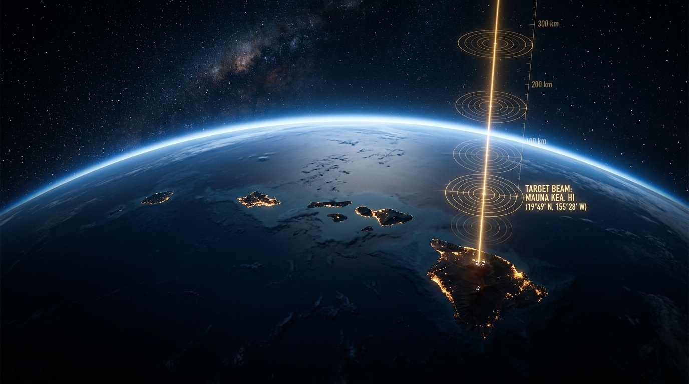
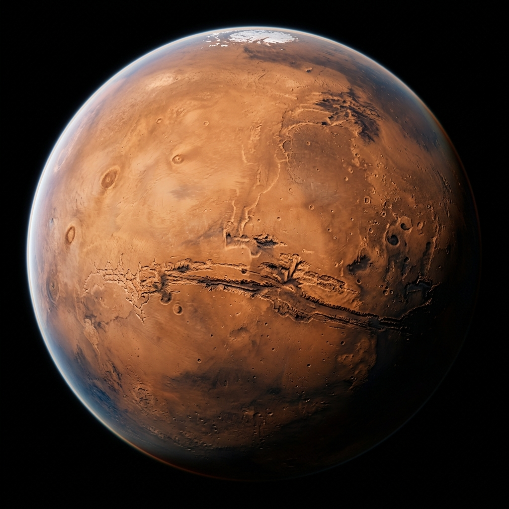
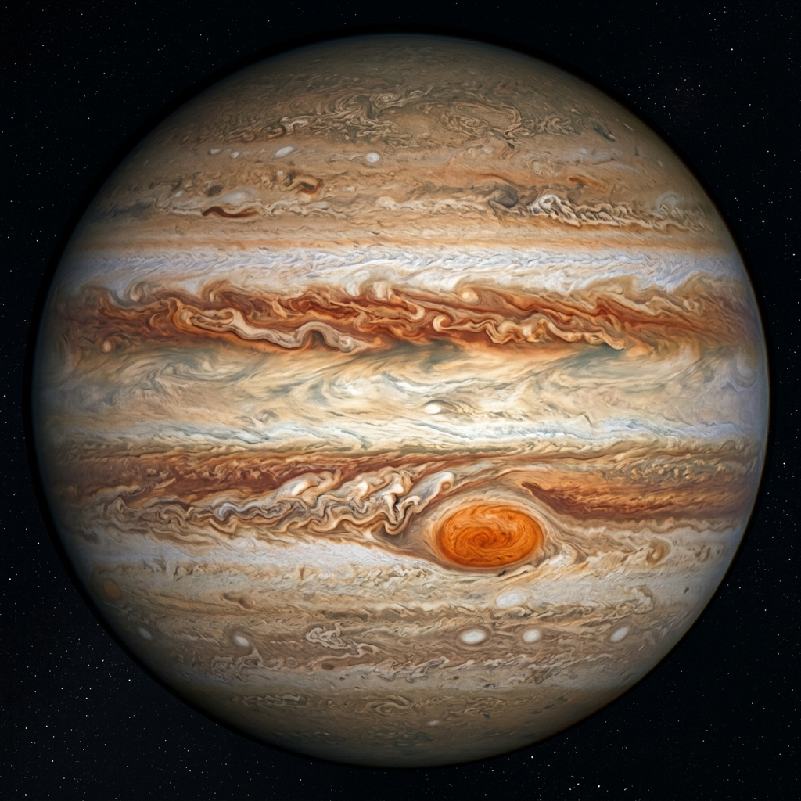
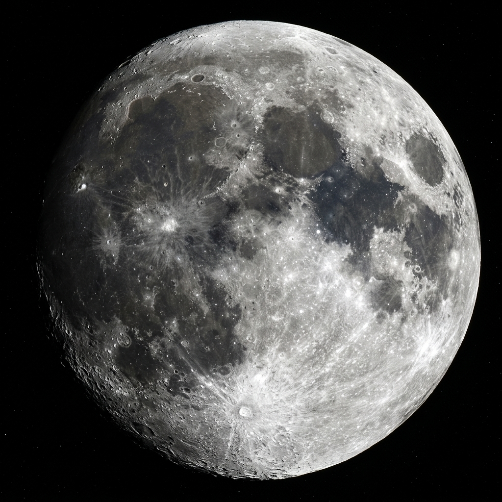

# 🌌 COSMORA

<div align="center">
  
  <br /><br />
  <strong>AI-Powered Space Exploration & Astronomy Education Platform</strong>
  <br />
  <em>Explore the universe. Ask questions. Get answers — powered by Groq.</em>
  <br /><br />
  
</div>

<br />

COSMORA is an interactive, web-based 3D space exploration platform that brings the universe directly to your browser. By combining real astronomical data, immersive 3D graphics, and **Groq AI (Bob)**, COSMORA allows users to seamlessly explore the Solar System, dive into Deep Space, and learn about celestial events — in a way that feels truly alive.

---

## 🚨 Problem Statement & Solution

**Problem Statement:**
Traditional astronomy education platforms are often static, text-heavy, and lack meaningful interactivity. Learning about the universe should not feel like reading a textbook — it should feel like a genuine exploration that sparks curiosity and wonder.

**Our Solution:**
COSMORA transforms astronomy education into a **living experience**. Users can "fly" through planets in a real-time 3D environment, ask an AI companion about any celestial object they are currently viewing, and track live NASA satellite data — making space education highly accessible, deeply interactive, and genuinely exciting for all ages.

---

## 🧠 AI Approach, Architecture & Theme

**Selected Theme:**
*Interactive Education & Space Exploration*

**System Architecture:**

| Layer | Technology |
|---|---|
| **Frontend** | Next.js 15 (App Router), TypeScript, Tailwind CSS, Framer Motion |
| **3D Engine** | Three.js, React Three Fiber, React Three Drei |
| **Backend & Auth** | Supabase (PostgreSQL + Row Level Security) |
| **AI Intelligence** | **Groq (Bob)** — Context-Aware NLP & Conversational Guide |
| **Data Sources** | NASA Public APIs (APOD, telemetry, celestial events) |

**AI Approach — Context-Aware Intelligence:**
COSMORA uses *Context-Aware Prompt Engineering* combined with natural language processing (NLP). The AI layer continuously receives the state of the user's 3D viewport (e.g., *"User is currently focused on Saturn's orbit"*) and feeds it to **Bob** as live context. This ensures every AI response is scientifically accurate and perfectly aligned with what the user is actually seeing — not just a generic astronomy lookup.

---

## 🤖 How Bob (Groq) Powers COSMORA

**Bob** is the core intelligence engine of COSMORA's Contextual AI Assistant. It is central to the experience, not an add-on.

### 1. 🌍 Contextual Interaction
When a user navigates to a planet, moon, or deep-space object, the object's coordinates, name, and telemetry data are packaged and sent to Bob as real-time context. Bob processes this information to generate scientifically grounded insights that are specifically relevant to what the user is viewing.

### 2. 🧑‍🚀 Personal Astronomer (Conversational Guide)
Bob acts as a **"Personal Astronomer"** embedded inside the 3D space. Instead of switching to a search engine or encyclopedia, users can ask questions directly within the simulation — for example:
> *"Bob, why is Mars red?"*
> *"Bob, how far is the Andromeda galaxy from Earth?"*
> *"Bob, what would happen if I stood on Jupiter?"*

Bob responds naturally, accurately, and contextually — like talking to a real astrophysicist.

### 3. 📡 NASA Data Interpretation
Raw astronomical telemetry from NASA can be complex and difficult to parse for non-experts. Bob is used to translate this technical data into clear, easy-to-understand explanations accessible to users of all ages and backgrounds.

---

## ✨ Key Features

- 🪐 **Interactive 3D Solar System** — Real-time WebGL rendering with full pan, zoom, and rotation of celestial objects.
- 🤖 **Contextual AI Assistant** — Powered by **Bob (Groq)**, the AI understands exactly which planet or object you are viewing and responds accordingly.
- 🚀 **Mission Logs & Telemetry** — Track historic space missions with realistic telemetry data visualizations.
- 🔭 **Observation Logbook** — A personal logbook to record your stargazing observations, secured with Supabase Row Level Security.
- 🛰️ **NASA API Integration** — Live tracking of celestial events, satellite data, and the Astronomy Picture of the Day (APOD).
- 🌌 **Deep Space Explorer** — Venture beyond the Solar System to explore nebulae, star clusters, and distant galaxies.

---

## 🛠️ Tech Stack

| Category | Stack |
|---|---|
| **Frontend Framework** | Next.js 15 (App Router) |
| **Language** | TypeScript |
| **Styling** | Tailwind CSS, Framer Motion |
| **3D Engine** | Three.js, React Three Fiber, React Three Drei |
| **Backend & Database** | Supabase (PostgreSQL, Row Level Security) |
| **AI Engine** | **Groq (Bob)** |
| **Data** | NASA Public APIs |
| **Deployment** | Vercel |

---

## 🚀 Getting Started

### Prerequisites
- Node.js v18 or higher
- A [Supabase](https://supabase.com/) account
- Groq API credentials
- NASA API Key (free at [api.nasa.gov](https://api.nasa.gov/))

### 1. Clone the Repository

```bash
git clone https://github.com/sayvixual/cosmora.git
cd cosmora
```

### 2. Install Dependencies

```bash
npm install
```

### 3. Configure Environment Variables

Copy the example environment file:

```bash
cp .env.example .env.local
```

Then fill in the following variables in `.env.local`:

```env
# Supabase
NEXT_PUBLIC_SUPABASE_URL=your_supabase_url
NEXT_PUBLIC_SUPABASE_ANON_KEY=your_supabase_anon_key

# Groq (Bob) AI
GROQ_API_KEY=your_groq_api_key

# NASA API
NASA_API_KEY=your_nasa_api_key
```

### 4. Run the Development Server

```bash
npm run dev
```

Open [http://localhost:3000](http://localhost:3000) to start exploring the universe.

---

## 🖼️ Screenshots

<div align="center">

| Mars | Jupiter | The Moon |
|:---:|:---:|:---:|
|  |  |  |

</div>

---

## ☁️ Deployment

COSMORA is optimized for deployment on [Vercel](https://vercel.com/). Ensure all environment variables are configured in your Vercel project dashboard before triggering a build.

```bash
# Production build (optional, for local verification)
npm run build
```

---

## 📁 Project Structure

```
cosmora/
├── src/
│   ├── app/              # Next.js App Router pages & API routes
│   ├── components/       # Reusable UI & 3D components
│   └── lib/
│       └── ai/           # Groq AI integration (system prompt, tools)
├── public/
│   ├── images/           # Astronomy imagery
│   └── models/           # 3D GLTF models (planets, etc.)
└── supabase/             # Database schema & migrations
```

---

## 📄 License

MIT License. See `LICENSE` for more information.

---

<div align="center">
  <strong>Built for the IBM Hackathon 2026</strong><br />
  <em>Powered by Groq · Supabase · Next.js · Three.js · NASA APIs</em>
</div>
